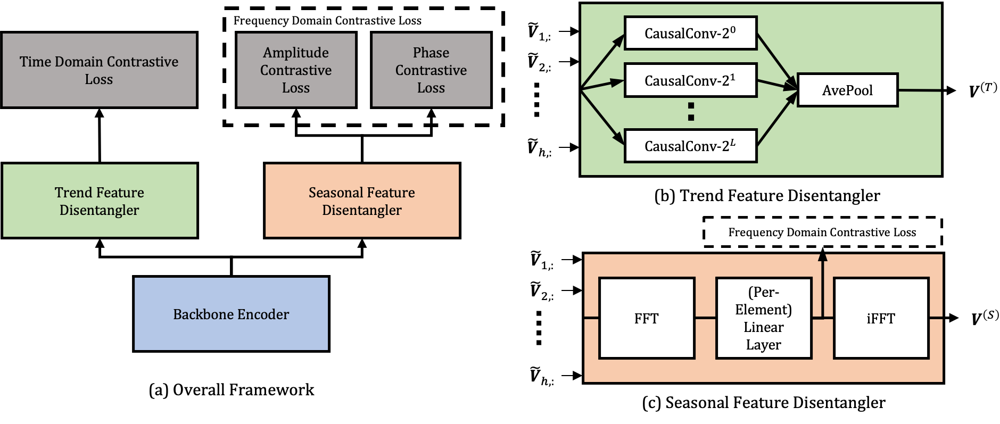

# CoST: Contrastive Learning of Disentangled Seasonal-Trend Representations for Time Series Forecasting



Official PyTorch code repository for the [CoST paper](https://openreview.net/forum?id=PilZY3omXV2). Required dependencies can be installed by:
```bash
pip install -r requirements.txt
```

## Data

The datasets can be obtained and put into `datasets/` folder in the following way:

* [3 ETT datasets](https://github.com/zhouhaoyi/ETDataset) should be placed at `datasets/ETTh1.csv`, `datasets/ETTh2.csv` and `datasets/ETTm1.csv`.
* [Electricity dataset](https://archive.ics.uci.edu/ml/datasets/ElectricityLoadDiagrams20112014) placed at `datasets/LD2011_2014.txt` and run `electricity.py`.
* [Weather dataset](https://drive.google.com/drive/folders/1ohGYWWohJlOlb2gsGTeEq3Wii2egnEPR) (link from [Informer repository](https://github.com/zhouhaoyi/Informer2020)) placed at `datasets/WTH.csv`
* [M5 dataset](https://drive.google.com/drive/folders/1D6EWdVSaOtrP1LEFh1REjI3vej6iUS_4) place `calendar.csv`, `sales_train_validation.csv`, `sales_train_evaluation.csv`, `sales_test_validation.csv` and `sales_test_evaluation.csv` at `datasets/` and run m5.py.

## Usage

To train and evaluate CoST on a dataset, run the following command:

```train & evaluate
python train.py <dataset_name> <run_name> --archive <archive> --batch-size <batch_size> --repr-dims <repr_dims> --gpu <gpu> --eval
```
The detailed descriptions about the arguments are as following:
| Parameter name | Description of parameter |
| --- | --- |
| dataset_name | The dataset name |
| run_name | The folder name used to save model, output and evaluation metrics. This can be set to any word |
| archive | The archive name that the dataset belongs to. This can be set to `forecast_csv` or `forecast_csv_univar` |
| batch_size | The batch size (defaults to 8) |
| repr_dims | The representation dimensions (defaults to 320) |
| gpu | The gpu no. used for training and inference (defaults to 0) |
| eval | Whether to perform evaluation after training |
| kernels | Kernel sizes for mixture of AR experts module |
| alpha | Weight for loss function |

(For descriptions of more arguments, run `python train.py -h`.)

After training and evaluation, the trained encoder, output and evaluation metrics can be found in `training/<DatasetName>/<RunName>_<Date>_<Time>/`. 

**Scripts:** The scripts for reproduction are provided in `scripts/` folder.

## FAQs
**Q**: ValueError: Found array with dim 4. StandardScaler expected <= 2.

**A**: Please install the appropriate package requirements as found in ```requirements.txt```, in particular, ```scikit_learn==0.24.1```.

## Acknowledgements
The implementation of CoST relies on resources from the following codebases and repositories, we thank the original authors for open-sourcing their work.
* https://github.com/yuezhihan/ts2vec
* https://github.com/zhouhaoyi/Informer2020

## Citation
Please consider citing if you find this code useful to your research.
<pre>@inproceedings{
    woo2022cost,
    title={Co{ST}: Contrastive Learning of Disentangled Seasonal-Trend Representations for Time Series Forecasting},
    author={Gerald Woo and Chenghao Liu and Doyen Sahoo and Akshat Kumar and Steven Hoi},
    booktitle={International Conference on Learning Representations},
    year={2022},
    url={https://openreview.net/forum?id=PilZY3omXV2}
}</pre>
